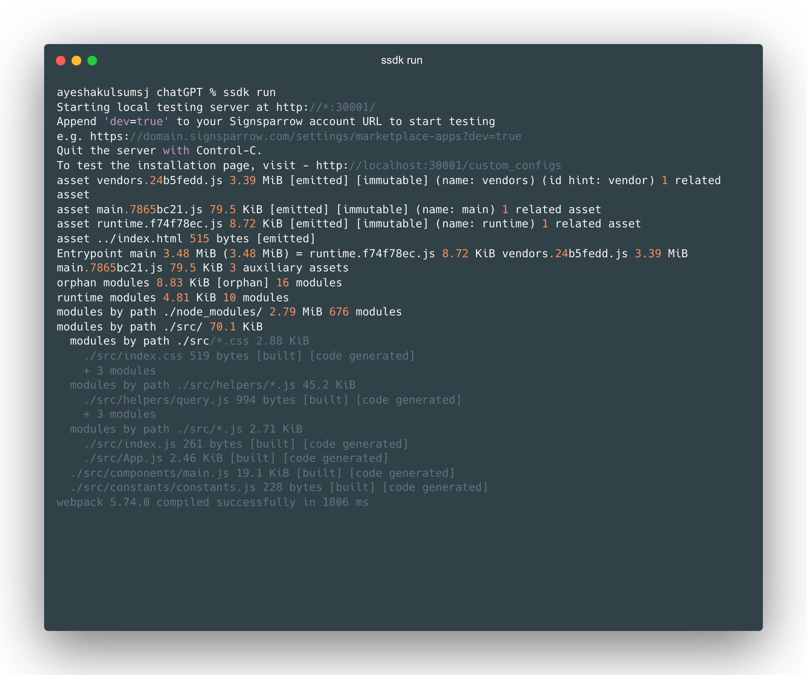
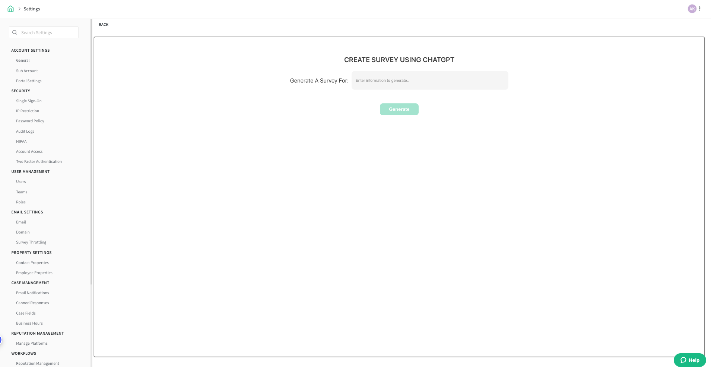

# Level 3 - React App

<!-- ------------------------ -->

## Overview

The SurveySparrow AppNest has recently introduced native support for React local development through the utilization of the SSDK, which incorporates [Webpack 5](https://webpack.js.org/blog/2020-10-10-webpack-5-release/). This comprehensive tutorial aims to assist you in implementing React applications using the SSDK, providing a step-by-step guide for building your very first React app.

**Note**: Please complete **Level-1** and **Level-2** to proceed with **Level-3**

### Implementation

The SSDK includes Webpack 5 by default and comes with a pre-configured Webpack configuration file, which is used during the compilation and build phases. When the SSDK detects that the project is developed with React, it automatically compiles the project using the default Webpack configuration.
Although the SSDK provides a default Webpack configuration for React apps, it also allows for the option of creating custom configurations. You can refer to this tutorial for guidance on creating your personalized webpack configuration.

### Prerequisites

- Familiarity with SurveySparrow app development.
- Experience with React app development.

### What we'll build today?

In this tutorial we will extend the `react_app` template and build a react app that helps to create survey using ChataGPT.

<!-- ------------------------ -->

## Create first React App

To create a new React project,

- Let’s create a new folder named “chatgpt” and open the terminal/command prompt inside the newly created folder.

```
mkdir chatgpt && cd chatgpt
```

Run the `ssdk create` command. Select the product of your choice and choose the template `react_app`.

After creating the project, run npm install to install all the dependencies and devDependencies.

```
npm install
```

Once the dependencies are installed, you can run the app.

```
ssdk run
```



Open the survey creation page with ?dev=true after the localhost is started with the above message.
Once your app is started in localhost with the above message, open a survey and navigate to the Build section. Append your URL with ?dev=true / Home page -> Create survey


<!-- ------------------------ -->

## React app folder structure

The React App in the SurveySparrow ecosystem is similar to the React app created using create-react-app or a React app bundled using the Webpack, with some minor changes in the folder structure to support integration with the SSDK.

The folder structure of the React app is explained below

```
├── __mocks__
│   └── svgrMock.js
├── app
│   ├── icon.svg
│   └── index.html
├── config
│   └── iparams.json
├── jest.config.js
├── log
│   └── ssdk.log
├── manifest.json
├── package.json
├── public
│   └── index.html
├── setUpTests.js
└── src
    ├── App.css
    ├── App.js
    ├── App.test.js
    ├── assets
    │   ├── icon.svg
    │   └── logo.svg
    ├── components
    │   └── HelloUser.js
    ├── hooks
    │   └── useScript.js
    ├── index.css
    ├── index.js
    └── logo.svg
```

### manifest.json file

The manifest.json file contains the app metadata about your app, such as app locations, platform version, and other app-related information.

### package.json file

The package.json file contains the information about the framework used in the app, the dependencies, and devDependencies used by the app, and configurations if any.

### app folder

The app folder contains the built/compiled assets of the app. The content of the app folder is served by the SSDK in https://localhost:30001/iframe during ssdk run

<!-- ------------------------ -->

## Working with React components in SSDK

Now that we have the template up and running for the React app without any errors, let us start building an app. iparams.json

```
{
    "surveysparrow_api_key": {
      "display_name": "SurveySparrow API Key",
      "description": "Please enter your SurveySparrow API key. You can find it in Settings -> Apps & Integrations -> Custom Apps.",
      "data-bind": "product.api_key",
      "required": true,
      "secure": true,
      "type": "api_key",
      "type_attributes": {
        "product": "surveysparrow"
      }
    }
  }

```

Replace the code in the file `src/components/main.js` with the code given below.

```
import React, { useState } from "react";
import {
  Button,
  Flex,
  FormInput,
  Heading,
  Text
} from "@sparrowengg/twigs-react";
import { query } from "../helpers/query";
import { generateQuestion } from "../helpers/generateQuestions";
import { createSurvey } from "../helpers/createSurvey";
import createQuestions from "../helpers/createQuestions";
import {
  ChevronRightIcon
} from "@sparrowengg/twigs-react-icons";

const Main = ({ client }) => {
  const [text, setText] = useState("");
  const [isDisabled, setIsDisabled] = useState(false);

  async function handleSubmit(e) {
    try {
      setIsDisabled(true);
      const response = await generateQuestion(query(text), client);
      const questionsArray = response?.choices[0]?.message?.content.split("\n");
      const creatSurveyRes = await createSurvey(text, client);

      const surveyObject = JSON.parse(creatSurveyRes).body;
      const surveyId = surveyObject?.data?.id;

      const len = questionsArray.length;
      await createQuestions(len, questionsArray, surveyId, client);
      document.getElementById("InputForChatGpt").value = "";
      client.interface.alertMessage("Survey Generated Successfully", {
        type: "success"
      });
    } catch (error) {
      document.getElementById("InputForChatGpt").value = "";
      client.interface.alertMessage(
        "Error while generating the survey. If your survey is malformed kindly delete it.",
        { type: "failure" }
      );
      console.log(error);
    } finally {
      setIsDisabled(false);
    }
  }
  return (
    <Flex
      alignItems="center"
      justifyContent="center"
      flexDirection="column"
      css={{
        height: "100vh"
      }}
    >
      <Heading
        css={{
          textTransform: "uppercase",
          textAlign: "center",
          color: "$black800",
          letterSpacing: "1.5px",
          marginBottom: "$8",
          borderBottom: "2px solid $black700"
        }}
        size="h4"
        weight="semibold"
      >
        Generate a survey using ChatGPT
      </Heading>
      <Text
        size="md"
        css={{
          marginBottom: "$6",
          maxWidth: 850,
          textAlign: "center",
          color: "$neutral800"
        }}
      >
        ChatGPT streamlines the process of crafting surveys by effortlessly
        generating questions that are both engaging and insightful, facilitating
        a more efficient survey creation experience.
      </Text>
      <Flex alignItems="flex-end" css={{ marginTop: "$10" }}>
        <FormInput
          css={{ width: 550 }}
          id={"InputForChatGpt"}
          size="xl"
          onChange={(e) => {
            setText(e.target.value);
          }}
          placeholder="Enter information to generate..."
        />
        <Button
          size="xl"
          color="primary"
          disabled={isDisabled || !text}
          onClick={handleSubmit}
          rightIcon={<ChevronRightIcon />}
          css={{
            marginLeft: "$12"
          }}
        >
          Generate Survey
        </Button>
      </Flex>
    </Flex>
  );
};
export default Main;
```

create constants directory

```
cd src/components && mkdir constants && cd constants && touch constants.js
```

add this constants below

For CHAT_GPT_TOKEN Login to [openAI](www.openAI.com). Click on View API Keys and Fetch Secret key and add it here.

```
export const chatGptToken = "CHAT_GPT_TOKEN";
export const chatGptUrl = "https://api.openai.com/v1/chat/completions";
export const url = "https://api.surveysparrow.com";
export const seperator = ":-:";
```

create helpers directory

```
cd .. && mkdir helpers
```

add this files given below

```
cd helpers && touch query.js
```

```
export const query = (content)=> {
    return({
    "model": "gpt-3.5-turbo",
    "messages": [{"role": "user", "content": `Please provide ten questions along with question types for ${content}, if the question type has multiple choices mention the choices in an array. Always mention the question type and choices after the question with a sepeartor ":-:"(sepearator should be none other than ":-:") between each of them(like: question:-:questionType:-:choices:-:mandatory). A question should be always followed by question type followed by choices, if there is no choices please mention it as empty array. Always mention the choices in a choices array.The question types should be one of TextInput, MultiChoice, YesNo, OpinionScale, DateTime, Scale, Ranking, NumberInput, EmailInput. OpinionScale and Scale question do not contain text choices. Also mention if the question is mandatory/not mandatory after the choices with ":-:" sepeartor`}]
    });
  }

```

touch createQuestions.js

```
import { url, seperator } from "../constants/constants";
export default async function createQuestions(len, questionsArray, surveyId, client){
    for (let i = 0; i < len; i++) {
      if (questionsArray[i].startsWith(" ")) {
        continue;
      }
      var { splitString, type } = splitBySeperator(questionsArray, i);
      let originalChoices = [];
      originalChoices = extractOriginalChoices(originalChoices, splitString);
      let choices = [];
      choices = generatePayloadForChoices(originalChoices, choices);
      const isRequired = splitString[3] === "Mandatory" || splitString[3] === "mandatory";
      let body = {};
      body = assignBody(type, body, surveyId, splitString, isRequired, choices);
      await createQuestion(client, body);
    }
  }

function generatePayloadForChoices(originalChoices, choices) {
    if (originalChoices?.length) {
        choices = originalChoices.map(str => {
            return { "text": str };
        });
    }
    return choices;
}

function extractOriginalChoices(originalChoices, splitString) {
    try {
        originalChoices = JSON.parse(splitString[2].replace(/'/g, '"'));
    } catch (error) {
        console.log('JSON parse error ');
    }
    return originalChoices;
}

function splitBySeperator(questionsArray, i) {
    const splitString = questionsArray[i].split(`${i + 1}.`)[1].split(seperator);
    let type = splitString[1].trim();
    type = typeCheck(type);
    return { splitString, type };
}

async function createQuestion(client, body) {
    await client.request.post(`${url}/v3/questions`, {
        options: {
            headers: {
                "Authorization": "Bearer <%=iparams.surveysparrow_api_key%>"
            }
        }
    },
        body
    );
}

function assignBody(type, body, surveyId, splitString, isRequired, choices) {
    if (type === "MultiChoice" || type === "RankOrder") {
        body = {
            "survey_id": surveyId,
            "question": {
                "text": splitString[0],
                "type": type,
                "required": isRequired,
                "choices": choices
            }
        };
    } else {
        body = {
            "survey_id": surveyId,
            "question": {
                "text": splitString[0],
                "type": type,
                "required": isRequired,
            }
        };
    }
    return body;
}

function typeCheck(type) {
    if (type === 'Scale') {
        type = "OpinionScale";
    } else if (type === "Ranking") {
        type = "RankOrder";
    }
    return type;
}

```

touch createSurvey.js

```
import { url } from "../constants/constants";
export const createSurvey = async (name, client) => {
    return await client.request.post(`${url}/v3/surveys`,{options:{
        headers:{
          "Authorization":"Bearer <%=iparams.surveysparrow_api_key%>"
        }
      }},
        {
          "name": name,
          "survey_type": "ClassicForm"
        }
      );
}
```

touch generateQuestions.js

```
import {chatGptToken, chatGptUrl } from '../constants/constants';
export async function generateQuestion(body, client){
    const result = await client.request.post(chatGptUrl,{options:{
      headers:{
        "Content-type": "application/json; charset=UTF-8",
        "Authorization": `Bearer ${chatGptToken}`
      }
    }},body);
    console.log(result);
    return JSON.parse(result).body;
  }
```

In `manifest.json`, add whitelisted-domains and location as given below.

```
{
"platform-version": "1.0",
"product": {
  "surveysparrow": {
    "location": {
      "full_page_app": {
        "url": "index.html",
        "icon": "icon.svg"
      }
    }
  }
},
"whitelisted-domains": [
  "http://(.*).surveysparrow.test(.*)",
  "https://(.*).surveysparrow.com(.*)",
  "https://(.*).surveySparrow.com(.*)",
  "https://api.openai.com/v1/chat/completions"
],
"engines": {
  "node": "18.16.0",
  "ssdk": "0.1.1"
}
}
```

<!-- ------------------------ -->

## Testing the application

Please run `npm i` to install all packages including twigs.
Once the dependencies are installed, you can run the app using the below command. Go to app directory

```
ssdk run
```


Open Apps and Integrations page with ?dev=true and install the local app and then  
Open the survey create page with ?dev=true after the localhost is started with the above message.
Once your localhost is started with the above message, open a survey and navigate to the Build section. Append your URL with <strong>?dev=true </strong>


## Recap

In this Tutorial we learned about,

- Creating a react app using SSDK
- Using the platform features in the react app.

## Next steps

Now that you are familiar with creating a basic React app using SSDK, you can start building apps for your use cases.
