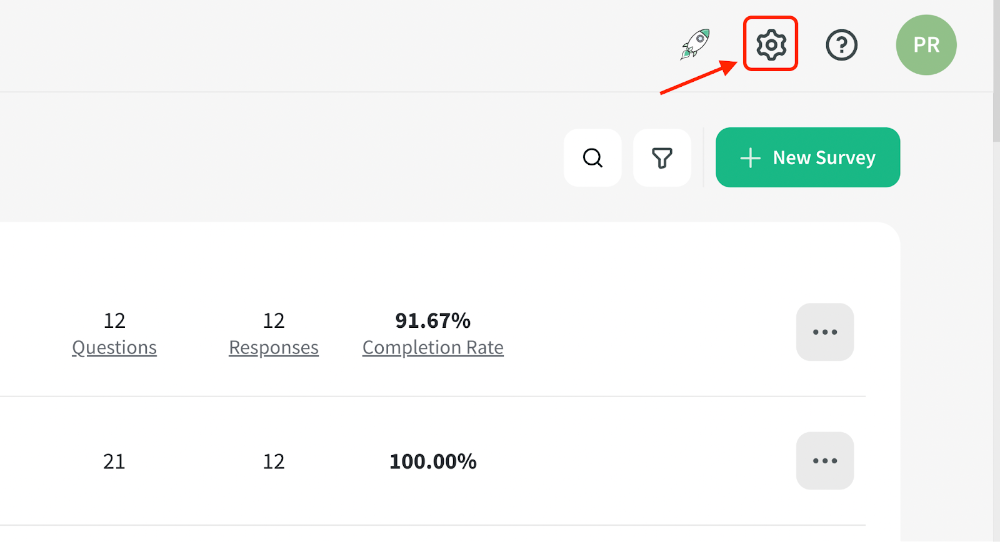
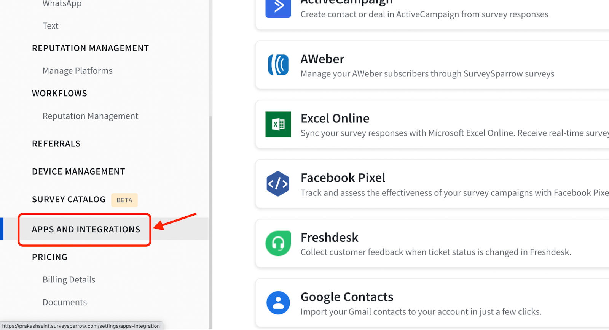
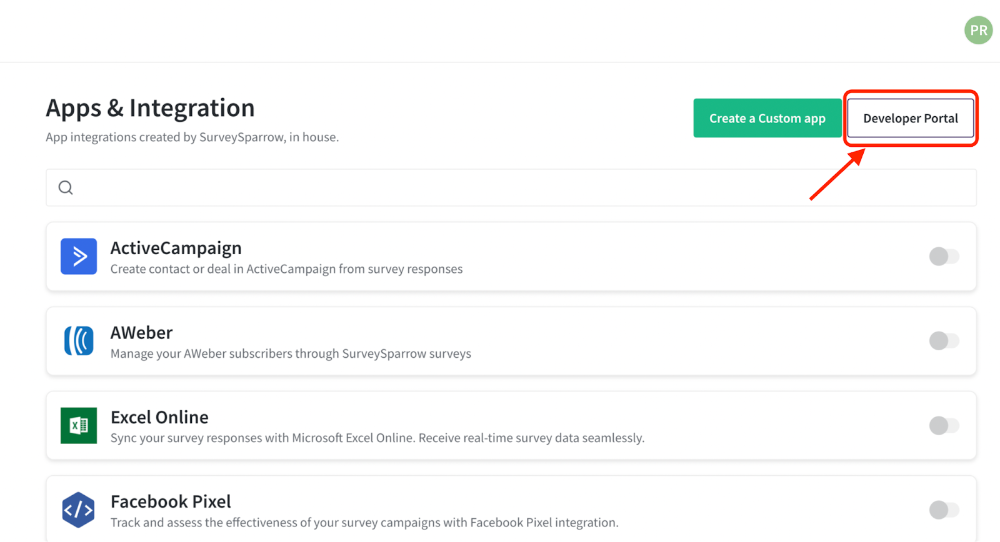
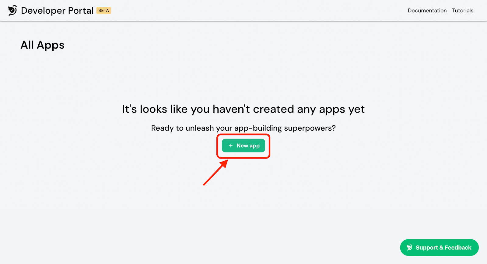
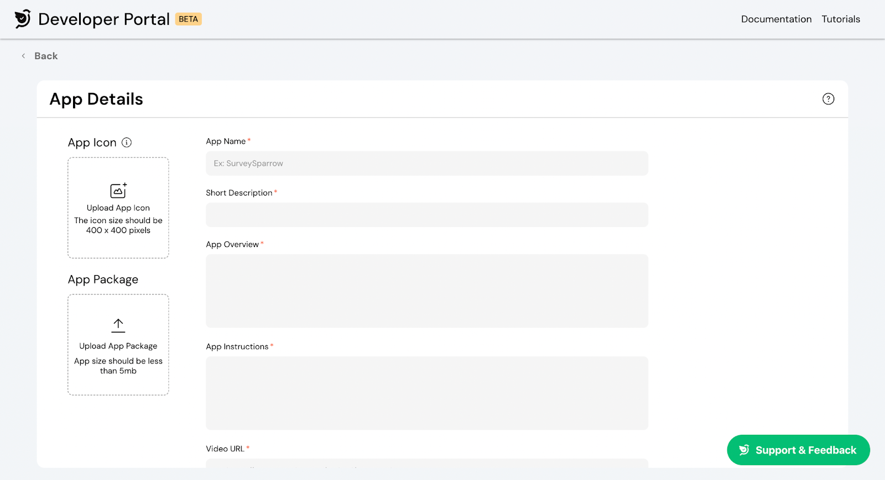

# Submitting app for review

<!-- ------------------------ -->

## Overview

Once you're ready with your developed app, you can proceed to submit it for review. SurveySparrow's App Review team will examine the application to make sure it adheres to the set guidelines of the SurveySparrow AppNest. Upon successful review of your application, the app will be approved and published on the SurveySparrow AppNest.

<!-- ------------------------ -->

## Submitting the app

- Log in to your SurveySparrow account.
- Navigate to Settings.
  
- Go to the Apps and Integrations section.
  
- Click Developer Portal.
  
- Click New app to get started with the app submission process.
  
- Fill in the required fields so that it becomes a smooth onboarding process for the users.
  
  #### Uploading App icon
      The app's icon should be 400 x 400 pixels. Ensure that the image is in one of the following formats: JPG, JPEG, or PNG. icon should be 400 x 400 pixels. Ensure that the image is in one of the following formats: JPG, JPEG, or PNG.
  #### Uploading App package
      Your packed app will be available as a zip file in the dist folder of your application.
      Upload the zip file to the Developer Portal. Make sure that the file size is less than 5MB.
- Click the Publish button.
  Your app is successfully submitted. Since, this is a custom app. It will be available for your account in Apps and Integrations page for installation.
  <!-- ------------------------ -->

## What's next?

If you want to publish public app, please contact SurveySparrow's App Review team and provide your app id and app name through support chat or community.
Upon submitting the app, SurveySparrow's App Review team will examine and analyze it. Upon successful review, your app will be published on SurveySparrow's AppNest.
