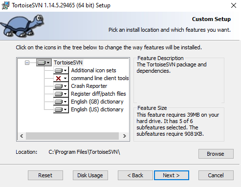
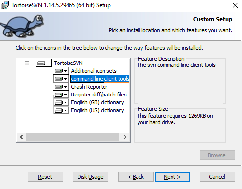
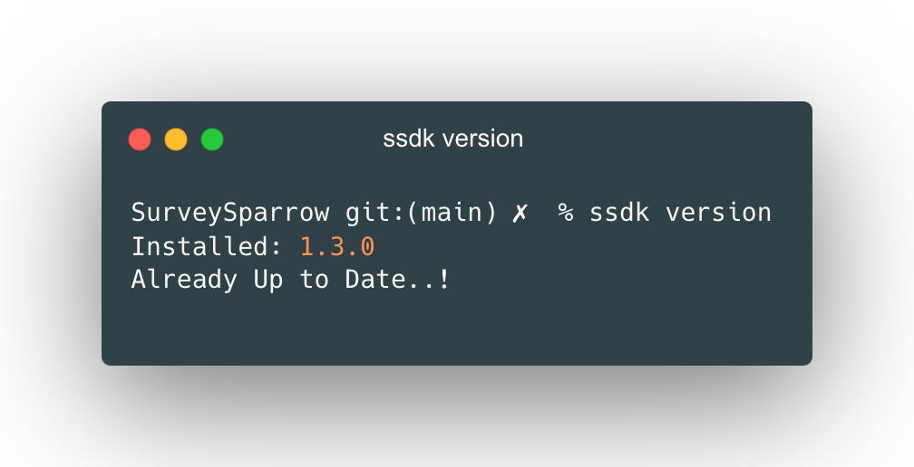
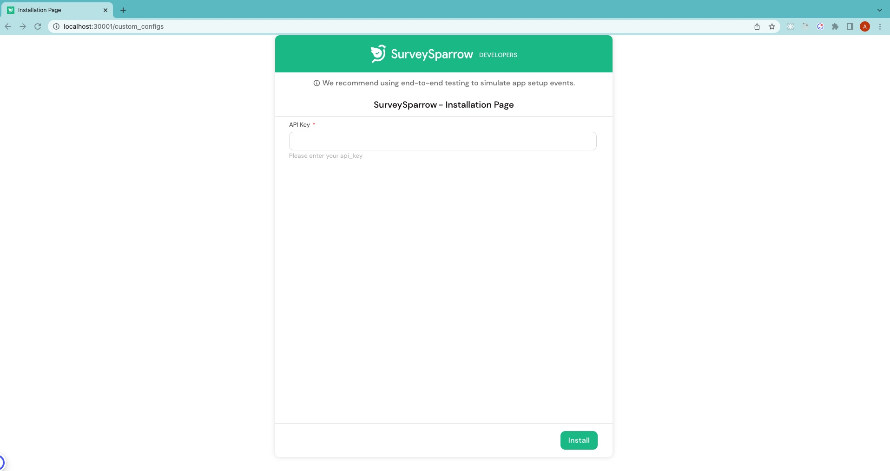
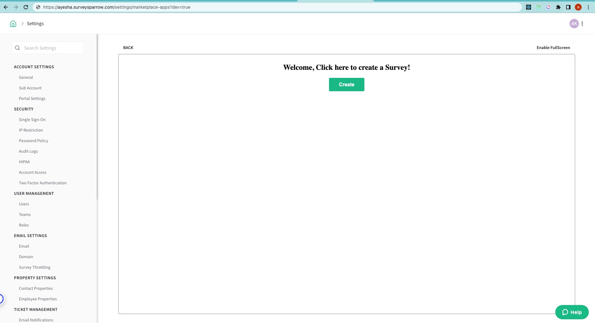

# Level 1 - Simple SSDK App

<!-- ------------------------ -->

## Overview

Developing a SurveySparrow app is a gateway to an enriching learning journey. As developers, you'll discover endless possibilities to amplify the platform's adaptability, empowering businesses to customize it to their unique needs.
With SurveySparrow apps, you can easily modify functionalities based on app locations and events. This flexibility allows you to modify the app to suit your needs.
In this tutorial, we will create a simple app to understand SurveySparrow AppNest's application structure.

### What you'll learn

By following this tutorial, you will gain knowledge in the following areas:

- Setting up SSDK in your local
- Creating a SurveySparrow app from scratch
- Understanding the basic structure of a SurveySparrow app
- Utilizing SSDK commands to build and run your app

### What you'll need

- A SurveySparrow [trial](https://surveysparrow.com/) account.
- One of the modern web browsers: Google Chrome, Mozilla Firefox, or Microsoft Edge. This tutorial uses Chrome.
- The latest version of the [SurveySparrow CLI (SSDK)](https://sdk.surveysparrow.dev) installed.
- A code editor such as Visual Studio Code, Sublime Text, or similar.
- Working knowledge of HTML, CSS, JavaScript, and browser development tools.

### What you'll build

You're going to develop an app that runs on the survey creation page. When a user clicks on the New Survey Button, the app shows a notification and creates a survey in SurveySparrow.

We will cover

- Local setup in your computer
- Usage of ssdk create command
- Front-end development of the application
- Survey API to create a survey in SurveySparrow
- Interface Method to present notifications
- Implementation of Installation parameters and set values
- Locations to place your app in the product

<!-- ------------------------ -->

## SSDK Setup

Install NVM and Node to develop an application in SurveySparrow.

### Install NVM

### MacOS

1. Install `brew` using the commands given below. If you have already installed it, please skip this step.

```
/bin/bash -c "$(curl -fsSL https://raw.githubusercontent.com/Homebrew/install/HEAD/install.sh)"
```

To Verify the installation

```
brew --version
```

2.Install NVM via brew

```
brew install nvm
```

### Windows

Installation using the Chocolatey package manager.

1. Launch Windows Powershell in Administrator mode.
2. Run the below command to install Chocolatey.

```
Set-ExecutionPolicy Bypass -Scope Process -Force; [System.Net.ServicePointManager]::SecurityProtocol = [System.Net.ServicePointManager]::SecurityProtocol -bor 3072; iex ((New-Object System.Net.WebClient).DownloadString('https://community.chocolatey.org/install.ps1'))
```

**Note:** If you are facing an error - **Running scripts is disabled on this system**, then run the command on the windows powershell `Set-ExecutionPolicy Unrestricted`

3. Verify Chocolatey installation using the command given below.

```
choco -v
```

4. Install NVM through the Chocolatey package manager.

```
choco install nvm
```

5. Verify NVM installation

```
nvm --version
```

Install via installers

1. Download the NVM Setup from [here](https://github.com/coreybutler/nvm-windows/releases/download/1.1.11/nvm-setup.exe) and Complete the installation process using the steps given [here](https://github.com/coreybutler/nvm-windows#installation--upgrades).

### Ubuntu

1. If you don't have curl installed already, install it.

```
sudo apt-get install curl
```

2. Run the NVM installation script as shown below

```
curl -o- https://raw.githubusercontent.com/nvm-sh/nvm/v0.39.3/install.sh | bash
```

3. The script clones the nvm repository to ~/.nvm, and attempts to add the source lines from the snippet below to the correct profile file (~/.bash_profile, ~/.zshrc, ~/.profile, or ~/.bashrc).

```
export NVM_DIR="$([ -z "${XDG_CONFIG_HOME-}" ] && printf %s "${HOME}/.nvm" || printf %s "${XDG_CONFIG_HOME}/nvm")"
[ -s "$NVM_DIR/nvm.sh" ] && \. "$NVM_DIR/nvm.sh"
```

When faced with any issues, follow the instructions given [here](https://github.com/nvm-sh/nvm)
For more details, refer to

### Install Node

If you already have Node version <strong>v18.13.0</strong> installed locally, skip this step.

1. Check if you have installed nvm pointing to right version

```
nvm -v
```

2. Use NVM to install Node 18

```
nvm install 18
```

3. Use Node 18

```
nvm use 18
```

4. Verify the Node version

```
node -v
```

5. Set default alias for Node 18

```
nvm alias default 18
```

### Install Mkcert

Install Mkcert which automatically creates and installs a local CA in the system root store, and generates locally-trusted certificates.

Mkcert does not have native support in Firefox. To proceed with your development work, you have the choice to either bypass security measures or manually integrate the certificate into your browser settings.

### MacOS and Ubuntu

```
brew install mkcert
```

### Windows

```
choco install mkcert
```

If you face any issues, follow the instructions given [here](https://github.com/FiloSottile/mkcert)

### Install SSDK

If you are already using the SSDK, skip this step. If you are installing SSDK for the first time, follow the instructions.

1. Use Node Package Manager (NPM) to install the latest CLI

```
npm install https://ssdk.surveysparrow.dev/ssdk.tgz -g
```

2. Verify the installation using the command below

```
ssdk version
```

### Installation summary

Ensure that the versions of the corresponding packages are as suggested or higher.

```
#for nvm -v
0.38.0
# for node -v
v18.16.0
# for npm -v
9.5.1
# for ssdk version
0.1.0
```

### Essential Considerations

During your free trial with SurveySparrow, we intentionally set our API quota to nil for added security measures.

Encountering the 429 Error message? That's our friendly reminder that you've hit the limit. To elevate your API quota, kindly complete our brief survey. Provide your SurveySparrow account's domain and share insights into the purpose behind your need for SurveySparrow public API.

Following a thorough review, we'll gladly enhance your API quota. Look out for a confirmation email detailing the updated quota.

Survey Link - https://sprw.io/stt-ik1w8xpUfPPgrrzF9n1S2C

## Demo of the App

Let's learn how to run the AppNest app in your local.

### Grab the API Key

Create a [SurveySparrow](https://surveysparrow.com/) trial account, or use your existing account to get your API key.

- Go to <strong>"Settings" </strong>
- Scroll down to <strong>"Apps and Integrations"</strong>
- Click on <strong>Create a custom app</strong>, and fill all the details and save
- Get your API key and copy it to the clipboard

### Clone the project

Open up your terminal and implement any of below ways to clone the project repository.

### The first method

```bash
git clone https://github.com/surveysparrow/appnest.git

cd tutorials-apps/first-app
```

You can also find other sample projects in the <strong>tutorials-apps</strong> folder. Feel free to check it out!

### The second method

<strong>For Mac,</strong>
1. Install svn: ```bash brew install svn ```

2. Clone the app:

```bash
svn checkout https://github.com/surveysparrow/appnest/trunk/tutorials-apps/first-app
```

<strong>For Windows,</strong>
1. Install svn: ```bash https://tortoisesvn.net/downloads.html ```

2. Run the Installer(.msi) file

3. During the <strong>custom setup</strong> section of installation, toggle the <strong>command line client tools</strong> and select <strong>entire feature will be installed on local hard drive</strong>





4. Finish the setup

5. Clone the app:

```bash
svn checkout https://github.com/surveysparrow/appnest/trunk/tutorials-apps/first-app
```

Alternatively, you can download the project repository zip and extract it to a directory of your choice.

```bash
https://github.com/surveysparrow/appnest
```

### Run the application

Check if the SSDK is installed in your computer.


Open the project folder in your code editor, and get into the terminal, move to the **first-app** folder and execute the following commands

```bash
SSDK run
```

If you are running the above command for the first time, it will ask for your consent to install certificates in your browser. This installs a local CA in the system root store and generates locally-trusted certificates.
Before viewing the app, let us open the installation page running at port 30001 of the [https://localhost:30001/custom_configs/](https://localhost:30001/custom_configs/) which will look like the image shown below. Enter your SurveySparrow API key and click Install.


To check the application, navigate to [apps page](https://domain.surveysparrow.com/settings/marketplace-apps?dev=true). When you click on Create Survey button, Survey gets created automatically.



<!-- ------------------------ -->

## Configurations

### Installation Parameters

Installation Parameters are values that are collected during the app's installation. In this app, we are collecting API keys. Navigate to the config folder. Open the iparams.json file and add the following JSON code.

```
{
    "surveysparrow_api_key": {
        "display_name": "SurveySparrow API Key",
        "description": "Please enter your SurveySparrow API key. You can find it in Settings -> Apps & Integrations -> Custom Apps",
        "data-bind": "product.api_key",
        "required": true,
        "secure": true,
        "type": "api_key",
        "type_attributes": {
            "product": "surveysparrow"
        }
    }
}
```

### App Manifest

The `manifest.json` file contains information such as product, location where you want to place your app, whitelisted domains, events, functions, engines with node and SSDK. Essentially, it helps to build, test, validate, and pack your app.

```
{
 "platform-version": "1.0",
 "product": {
   "surveysparrow": {
     "location": {
       "full_page_app": {
         "url": "index.html",
         "icon": "styles/images/icon.svg"
       }
     }
   }
 },
 "whitelisted-domains": [
   "https://api.surveysparrow.com/v3/questions",
   "https://api.surveysparrow.com/v3/surveys"
 ],
 "engines": {
   "node": "18.16.0",
   "ssdk": "0.1.1"
 }
}
```

## Create the Survey creation app using APIs

This app will create a survey with the click of the <strong>Create</strong> button. Let's code together in this tutorial.
We will attain this in a few steps:
Fetch the API key from the installation parameters. Make a POST request to the Survey API endpoint to create a new survey. After the survey is successfully created, a notification banner will appear. To start, please replace the body in `index.html` with the following code.

```
<body>
  <div class="main">
    <h2>Welcome, Click here to create a Survey!</h2>
    <button id="btn">Create</button>
    <p id="msg"></p>
  </div>
</body>
```

Clear `app.js` and paste the code given below to start the application.

```
var client;

init();

async function init() {
  client = await window.app.initialized();
}

```

Add the constants required for this app.

```
const questions = [
  "What is your name?",
  "Where are you from?",
  "What is your favourite dish?",
  "Rate yourself out of 10",
  "Name one thing which helps to save this world?",
];

const API_BASE_URL = "https://api.surveysparrow.com/v3/";
const headers = {
  options: {
    headers: {
      Authorization: `Bearer <%= iparams.surveysparrow_api_key %>`,
    },
  },
};
```

Let's start adding logic to the following code.

```
const button = document.getElementById("btn");
const message = document.getElementById("msg");

button.onclick = createSurvey;

async function createSurvey() {
  try {
    button.innerHTML = "Your Survey is being created...";

    // Create the Survey
    const surveyId = await postSurvey();

    // Create questions for the Survey
    for (let question of questions) {
      await postQuestion(surveyId, question);
    }

    button.innerHTML = "Create";
    showNotificationMessage("Survey Created Successfully", { type: "success" });
  } catch (error) {
    button.innerHTML = "Create";
    console.log("Error while creating the Survey", error);
    showNotificationMessage("Error while Creating Survey", { type: "failure" });
  }
}

```

The `createSurvey` function will create a survey and add the questions with the click of a button and shows a success message notification. Similarly, upon a failure case it will display error message notification, and the same will be printed in the console.

```
async function postSurvey() {
  const response = await client.request.post(`${API_BASE_URL}surveys`, headers, {
    name: "My Marketplace Survey",
    survey_type: "ClassicForm",
  });
  return JSON.parse(response).body.data.id;
}
```

The `postSurvey` function will create a survey in the SurveySparrow account. Here, we are using request method to create a survey.

```
async function postQuestion(surveyId, question) {
  await client.request.post(`${API_BASE_URL}questions`, headers, {
    survey_id: surveyId,
    question: {
      type: "TextInput",
      text: question,
    },
  });
}
```

The `postQuestion` function will create question in the SurveySparrow account.

```
function showNotificationMessage(message, options) {
  client.interface.alertMessage(message, options);
  if (options.type === "success") {
    message.innerHTML = "Please navigate to home screen to see newly created Survey.";
    setTimeout(() => {
      message.innerHTML = "";
    }, 3000);
  }
}
```

The `showNotificationMessage` function will show notification and here we are using interface method. Please refer documentation to learn more about this.

<!-- ------------------------ -->

## Testing the application

Congratulations on making it so far! You can start application with single command🎉

```
ssdk run
```

You can test the app as discussed in the `Demo of the App` section. As the above command executes, open the Installation page at [https://localhost:30001/custom_configs](https://localhost:30001/custom_configs) and set the value of the API key fields. Navigate to the page [https://Yourdomain.surveysparrow.com/settings/marketplace-apps](https://Yourdomain.surveysparrow.com/settings/marketplace-apps) in SurveySparrow and append `?dev=true` to the URL or you can just open [https://domain.surveysparrow.com/settings/marketplace-apps?dev=true](https://domain.surveysparrow.com/settings/marketplace-apps?dev=true).

You can find your local application on this location!!

If needed, you can change the app location in the manifest.json to preview the app in a different place in SurveySparrow. Refer the SSDK CLI documentation for more information.

## Recap

In this Tutorial we learned about,

- The local setup in your computer
- The usage of ssdk create command
- The front-end development of the application
- The use of the Survey API to create a Survey in SurveySparrow
- The use of the Interface Method to present notifications
- The implementation of Installation parameters and set values
- Locations to place the app in the product

## Next steps

Please refer to the below resources for more details.

### Resources

- Be sure to check out the SSDK Documentation
- Explore more codelabs at surveysparrow.dev/codelabs

### Help

Feel free to reach out to us at <strong>support@surveysparrow.dev</strong> if you have any questions. Collaborate with your developer peers on community.surveysparrow.com to discuss and keep yourself updated through knowledge sharing.
