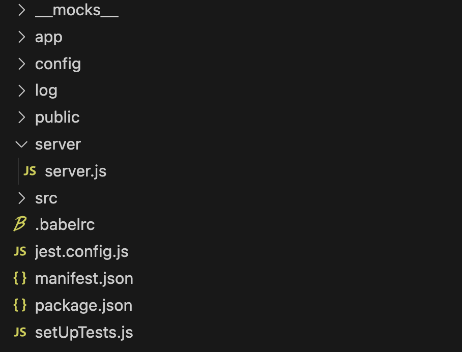

# React + Serverless App

There are generally 2 ways to build apps on AppNest. One way is building a React application with a solid UI and the other is building a serverless applications to listen to the events triggering in SurveySparrow and ThriveSparrow. But most apps require both the serverless and React functionalities to reduce and satisfy the customer requirements.

For instance, let's consider integrating **Notion** with **SurveySparrow**. When a user submit a response on a specific survey, the response should be automatically added to a Notion Table within a Notion Page. To implement this functionality, we can utilize the serverless app to listen to the **onSubmissionComplete** event and perform the necessary actions when that event gets triggered.

Here, what if the user wants to choose a specific survey? what if the user wants to specify which page or which table or which columns they want to send their responses to? To solve such questions, we need the React App with a solid UI. The user will be prompted with a dropdown to select a survey and mapping columns to choose the page, table, column types, etc. With the help of these configurations specified by the user, the data will be stored in their Notion account accordingly.

That's the purpose of React + Serverless App.

## How to set up the React + Serverless application?

First familiarize yourself with the [React App](../apps/react_app.md) and the [Serverless App](../apps/react_serverless_app.md) before proceeding with the next steps.

### Step 1

- Run the command `ssdk create` to initialize the application.
- Choose a product, either SurveySparrow or ThriveSparrow.
- Select **react_app** which will generate the boilerplate files for react application.

### Step 2

- Create a folder named **server** within the root directory. Within the server folder, create a file name **server.js** and write your handler functions.
- In the manifest.json, specify the events along with the name of the respective handler functions.

#### Setup - React + Serverless


### Step 3

- Run the command ``` npm install ``` or ``` npm i ``` to install all the necessary dependencies which includes Twigs library.
- Run the command ``` ssdk run ``` to view your application on your SurveySparrow account within an Iframe.


### Step 4:
- Go to this url - **https://domain.surveysparrow.com/settings/apps-integration?dev=true**. Make sure to append ?dev=true as your application is in development mode.
- Find the **SurveySparrow App** at the bottom of the page and toggle the icon to install it. If you have specified IParams or OAuth in your application, you will be redirected to another page. Otherwise, the app will be installed right away.
- The default location for previewing your application is **full_page_app** which you can find in the manifest.json file. The URL for this location is **https://domain.surveysparrow.com/settings/marketplace-apps?dev=true**

- Refer the [App Manifest](https://sdk.surveysparrow.dev/docs/configuration/app-manifest.html) to learn more about the various locations to preview the React applications.