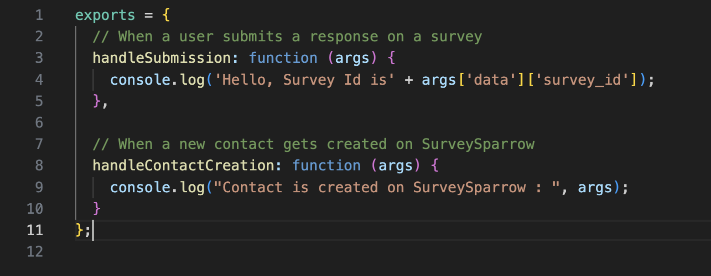
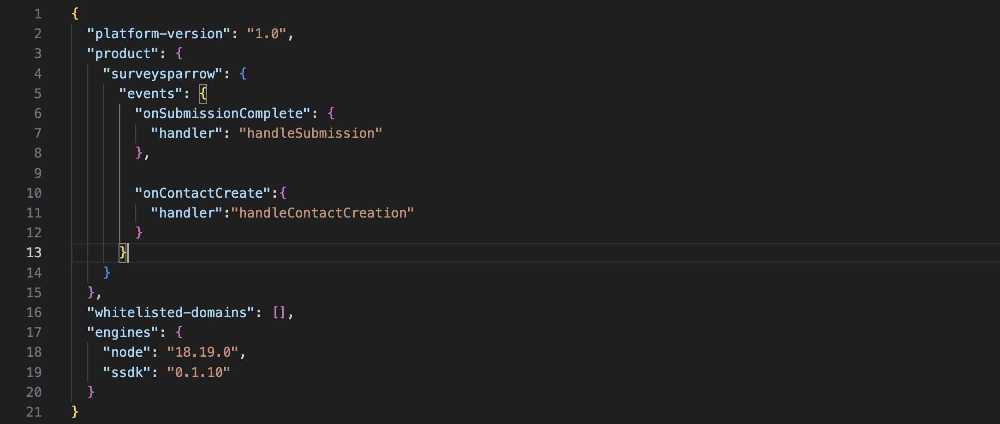

# Serverless App

Serveless Applications are build to access events in SurveySparrow and ThriveSparrow and perform necessary actions when those events get triggered. 

## Events
An event can be defined as a change of state. It is used to notify someone that something has happened. There are various events in SurveySparrow and ThriveSparrow. Please refer to this [section](../serverless/#sample-payloads-of-each-of-the-events) for more information.

For instance, let's consider **onSubmissionComplete** event in SurveySparrow. This event is triggered every time a user submits a response on any of the surveys in SurveySparrow. To listen to those event triggers, you can build a serverless application using the SSDK CLI and recieve the event payload associated with the event trigger. In this example, it is the submission payload which you will recieve every time the user submits a response.

## How to set up a serverless app?
Serverless applications don't require a UI. Hence, the functionalities should be implemented within the server-side.

**Note:** While using serverless application, there are some key things to consider. Check out this [documentation](../serverless/#key-considerations) to learn more.

### Step 1:
- Run the command `ssdk create` to initialize the application.
- Choose a product, either SurveySparrow or ThriveSparrow.
- Select **serverless_app** which will generate the boilerplate files for react application.

### Step 2:
- The manifest.json file contains a property called **events**. It allows you to specify which events the serverless application will be listening to. That is, if the application needs to be notified every time an event trigger happens in SurveySparrow, you can specify the name of the event along with the **handler function**. The handler functions are responsible for performing certain tasks when the respective event gets triggered.

### Step 3:
- In the server.js, within the exports statement, write your handler functions. Specify the name of the handler functions in the manifest.json within the corresponding event.

#### In server.js

#### In manifest.json

- To test the application, Go to this url - **https://domain.surveysparrow.com/settings/apps-integration?dev=true**. Make sure to append **?dev=true** as your application is in development mode.

- Find the **SurveySparrow App** at the bottom of the page and toggle the icon to install it. If you have specified IParams or OAuth in your application, you will be redirected to another page. Otherwise, the app will be installed right away.

- Then, visit the URL - **https://localhost:30001/web/test** to see the Simulated Environment. This page will help you simulate the event triggers that are happening in your SurveySparrow account. Since your app is in development, the application can't listen to the actual event triggers. Hence, this simulated environment will allow you to imitate such event triggers.

- Check out the [serverless documentation](../serverless/index.md) for more information.

