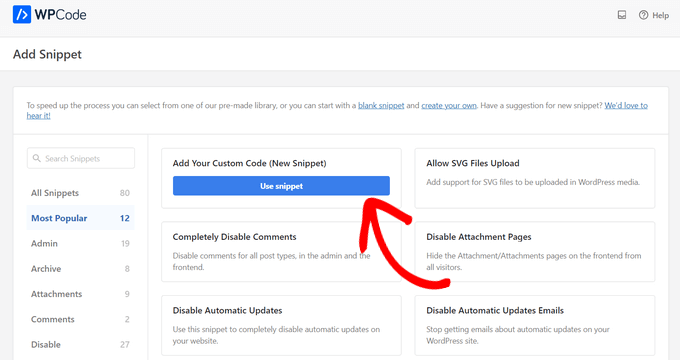
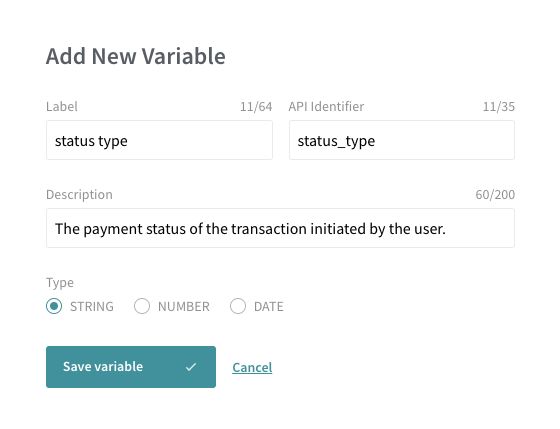
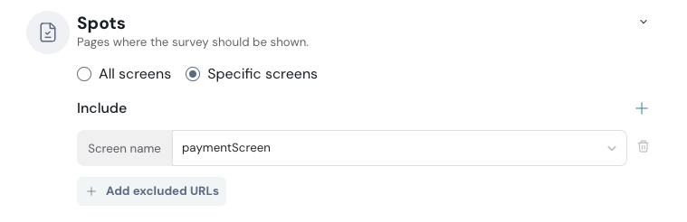
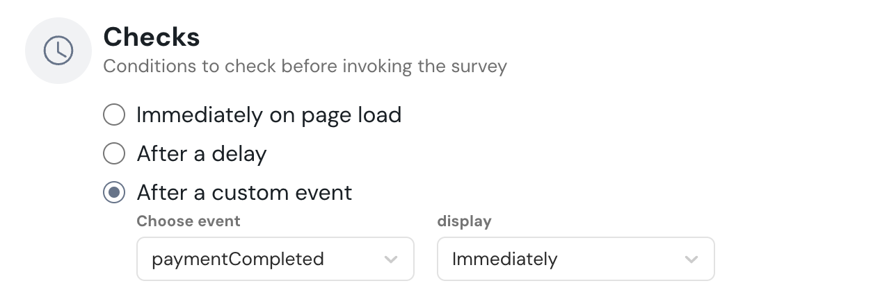
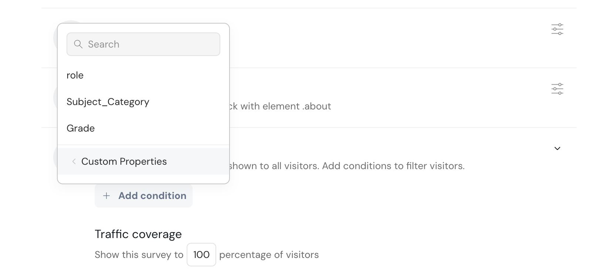

# Mobile Spotchecks

There are 4 types of conditions on which Spotchecks can be configured.

- Spots
- Checks
- Visitors
- Recurrence

### Spots

Spots allow you to set conditions on which page the surveys should be displayed. For instance, if you require the app to display only on certain pages or if you want to exclude certain pages, you can pass the specific URL or the page (for web targets) or screen name (for mobile targets) to enforce this page condition.

### Checks

Checks focus on triggering the surveys based on events within the application. For instance, if a survey needs to be popped when the user clicks on a button, you can simply pass the class name of the element. So, when the elements get clicked, the survey will be displayed on the application. Similarly, there are various events that when triggered, lead to the display of the survey. There are custom events as well.

### Visitors

It is used to set conditions based on visitors' metadata such as location, surveys, date, etc. 

### Recurrence

Recurrence defines the number of days, the survey is not allowed to be shown to the visitors of the app. This condition can also be set for various events happening in the survey. For instance, if you want the user to not see the survey for another 40 days when they respond to that survey, you can enter 40 days

There is also an option to pass custom properties to the event triggers using which you can set conditions in the visitors section of the configure panel.

