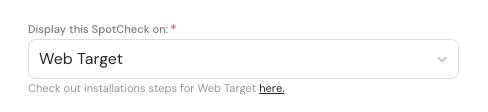
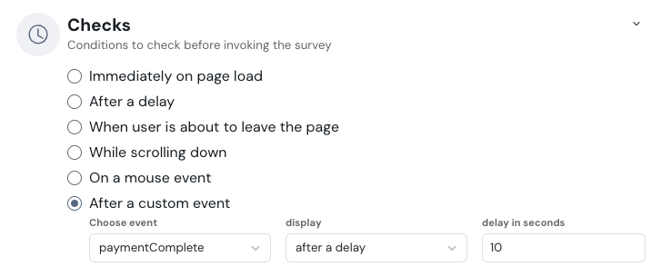

# Web SpotChecks

The step-by-step instructions to install SpotChecks within your web application are as follows. For each step below, the respective snippet is found in the SpotChecks.


## Setup

In the installation steps for the target, copy the JavaScript snippet and place it right before the **&lt;/body&gt;** on all the necessary pages. This bundled JavaScript allows for efficient interaction between the survey and your application.


**Note:** If your application runs on SPA(Single-Page Application) architecture, then the JavaScript snippet should be inserted in the root file. For instance, if you are using a React application, then you should insert it in the index.js file, right below the **&lt;App/&gt;** component. But if you are a using Multi-Page application, then the snippet should be inserted on all the necessary pages.

You can find the installation steps while creating the target or under the target dropdown field.

### Example:

```html
<!DOCTYPE html>
<html lang="en">
<head>
    <meta charset="UTF-8">
    <meta name="viewport" content="width=device-width, initial-scale=1.0">
    <title>Business Home Page</title>
    <style>
        body {
            font-family: Arial, sans-serif;
            text-align: center;
            padding: 50px;
        }
        header, footer {
            background-color: #f8f9fa;
            padding: 10px;
        }
        h1 {
            color: #333;
        }
    </style>
</head>
<body>
    <header>
        <h1>Business Name</h1>
    </header>
    <main>
        <p>Welcome to our business website!</p>
        <p>We offer great services and products to meet your needs.</p>
    </main>
    <footer>
        <p>&copy; 2024 Business Name. All rights reserved.</p>
    </footer>
    // insert the snippet right here
</body>
</html>

```


**Note:** Make sure to insert the snippet on all the necessary pages in your application.

***

## Survey Popup

The next step in the installation is to display the survey which requires adding the following snippet right below the installation snippet.


```html
<script>
    window.SpotCheckLauncher('popup', {
        userDetails: {
            email: "{your_email}",
        },
        variables: {
            variale_name: {variable_value}
        }, 
        properties: {
            property_1: {property_value}
        } 
    });
</script>

```

### userDetails

It is recommended to pass the visitor's or user's email or user's mobile in the userDetails. This will help create a contact in your SurveySparrow account. If no email or mobile is passed, then a unique ID will be generated and an anonymous contact will be created.

Also, If you are not collecting email from the user, then you can pass in a unique key in the userDetails in the below format. 


**Note:** the userDetails should be the same as the contact properties in SurveySparrow such as firstName, lastName, etc.


```html
<script>
    window.SpotCheckLauncher('popup', {
        userDetails: {
            uniqueKey: "{unique_key}", //(or)
            mobile: "{your_mobile_number}", // (or)
            email:"{your_email_id}"
        },
        variables: {
            variale_name: {variable_value}
        }, 
        properties: {
            property_1: {property_value}
        }
    });
</script>
```

In simple words, userDetails allows you to keep track of the user data and create a contact.


### variables

Global Variables are the key-value pairs that you pass as query parameters in the survey URL. You can find it in the builder section of the survey. Make sure to use the **API identifier** of the global variable, which you will find when you are creating a variable.

- While using variables of type "Date",  it is recommended to pass the value as a **String** in the following format -> **"yyyy-mm-dd"** or **"mm-dd-yyyy"**
- To dynamically change survey language, you can utilize the sparrowLang property within the variables. The key thing to note here is you can only use the **languages** configured in the languages tab of the **builder** page of a survey.


```html
<script>
    window.SpotCheckLauncher('popup', {
        userDetails: {},
        variables: {
            sparrowLang: "en" // Eg: en(English), fr(French)
        }, 
        properties: {}
    });
</script>
```


### properties

These are the custom properties that you can pass along with the survey trigger. These properties can be used as a condition in the **"visitors"** section of the **configure** panel.

To set a condition, go to the Configure panel, click on **visitors**, add a condition, select **Visitor Properties **, and then select **Custom Properties**. The Custom Properties can be shown only when the survey is triggered for the first time. 

## Dynamic Language Change

To dynamically change the survey language after the Spotchecks survey appears in the UI, use the following syntax:


```html
<script>
    window.SpotCheckLauncher('changeLanguage', {
      sparrowLang: 'en' // Ex: en(English), es(Spanish) 
    });
</script>
```

## Listening to Mouse Events

To let spotcheck listen to the events happening within the application and trigger the survey when those events get triggered, just pass the class name or the ID of the element in the checks section of the configure panel.

### Example

```html
<button id = "survey-trigger">
    Click Now
</button>
```

Go to the **"configure"** panel, toggle the **"Checks"** section, choose **"on a mouse event"**, select the event **click** and enter the id(#survey-trigger) of the button element in the **"Add element"** field. You can also enter the class name of the element.

The list of all mouse events is as follows:

- Click
- MouseOver
- MouseOut
- MouseEnter
- MouseLeave


## Listening to Custom Events

In some instances, your app might need more events because the existing mouse events might not suffice the app's requirements. In that case, Spotcheck allows you to create a new event and trigger that event from within your app. 

Go to the **"configure"** panel, toggle the **"Checks"** section, and choose **"After a custom event"**. Here, you can create a new event and also choose when the survey should be displayed when that event gets triggered.



Below is the syntax to set up custom events in your web application.

```js
window.SpotCheckLauncher('customEvent', {
    customEvent: { 
      eventName: { // Specify the custom event name here. Ex: paymentComplete
        eventProperty: 'Value' // Specify the custom event properties.
      }
    }
  });
```
There is also an option to pass custom properties to the event triggers using which you can set conditions in the visitors section of the configure panel.



